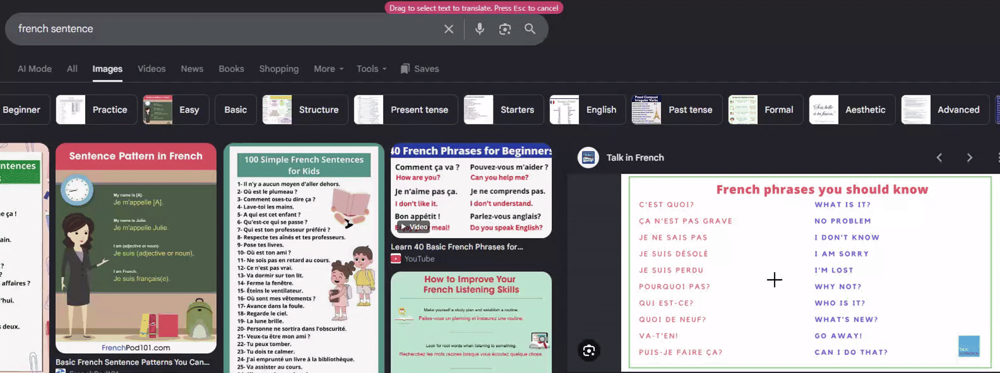

# Snip Translate

A Chrome extension that allows you to press a shortcut, drag a box around any part of a page (including images and videos), and get an instant translation popup.

Chinese text also gets its romanised version (pinyin) shown above each character.

## Demo




## Usage

Press `Ctrl+Shift+F` (`Cmd+Shift+F` on Mac), drag a box around any text, and it OCRs and translates whatever's inside.

The origin language can be selected in the extension pop-up or options page. On the options page, additional API keys can also be added to use alternative engines.

## OCR and Translation Engines

Text is read locally with Tesseract by default, which requires no setup. Add an [OCR.space](https://ocr.space/OCRAPI) key in settings for a more accurate cloud engine. This is free but limited to 500 requests/day and 25000 requests/month. The extension will fall back to Tesseract if it fails or the limit is hit.

Translation uses Google's free endpoint by default. Add a [DeepL](https://www.deepl.com/pro-api) key for higher reliability, same fallback behaviour.

Both keys are stored in `chrome.storage.sync`, so they sync across your signed-in devices, and are only sent to their own provider.

## How to Set Up

```sh
npm install
npm run dev
```

Load the `dist/` directory as an unpacked extension at `chrome://extensions`.

`npm run build` for a production build.
